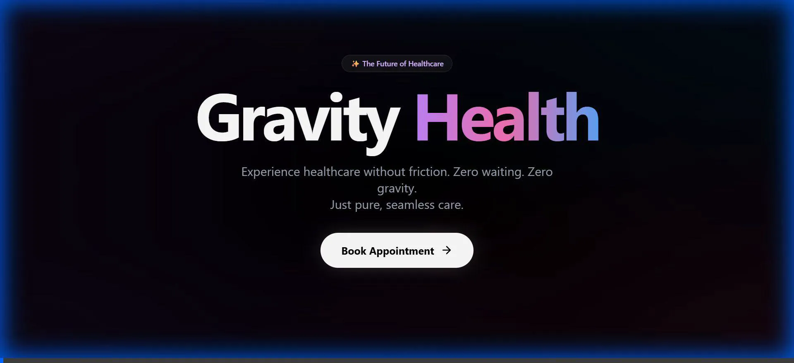

# 🏥 Gravity Health - Next-Gen Appointment System



<div align="center">

**Modern. Fast. Frictionless.**
<br>
*A state-of-the-art hospital appointment system built with the "Vibe Coding" philosophy.*

[](https://nextjs.org/)
[](https://tailwindcss.com/)
[](https://www.prisma.io/)
[](https://www.typescriptlang.org/)

</div>

---

## 🎓 Academic Project Info

This project was developed as part of the **Yazılım Gerçekleme ve Test** (Software Implementation and Testing) course.

| Role | Name |
| :--- | :--- |
| **Student** | **Yahya Özden** |
| **Course** | Yazılım Gerçekleme ve Test |
| **Instructors** | **Nurettin Şenyer**, **Ömer Durmuş** |

---

## 🌟 Project Overview

**Gravity Health** is not just another appointment booking app. It is a reimagining of how healthcare interfaces should feel. Moving away from sterile, clunky enterprise software, Gravity Health introduces a **"Glassmorphism"** aesthetic, **Aurora** background animations, and fluid micro-interactions to create a user experience that is both calming and efficient.

### Key Features

- **🌌 Aurora UI**: A dynamic, living background that shifts gently, providing a modern and premium feel.
- **💎 Glassmorphism Design**: Translucent cards with background blur filters (`backdrop-filter`) creating depth and hierarchy.
- **⚡ Zero-Friction Booking**: A streamlined, multi-step wizard that guides patients from specialty selection to confirmation in seconds.
- **📱 Responsive & Adaptive**: Flawless experience across all devices, from large desktop monitors to mobile phones.
- **✨ Micro-Interactions**: Subtle hover effects, smooth page transitions, and interactive elements that respond to user input instantly.

## 🛠️ Technology Stack

- **Frontend Framework**: [Next.js 14](https://nextjs.org/) (App Router)
- **Styling Engine**: [Tailwind CSS](https://tailwindcss.com/) + Custom CSS Modules
- **Animations**: [Framer Motion](https://www.framer.com/motion/) for complex transitions.
- **Database**: [Prisma](https://www.prisma.io/) with SQLite (Development) / PostgreSQL (Production Ready).
- **Language**: TypeScript for type safety and robust code.
- **Icons**: [Lucide React](https://lucide.dev/) for clean, consistent iconography.

## 🚀 Installation & Setup

Follow these steps to get the project running on your local machine.

### Prerequisites
- Node.js (v18 or higher)
- npm or yarn

### Steps

1.  **Clone the Repository**
    ```bash
    git clone https://github.com/yourusername/gravity-health.git
    cd gravity-health
    ```

2.  **Install Dependencies**
    ```bash
    npm install
    ```

3.  **Initialize Database**
    This project uses Prisma with a local SQLite database for ease of setup.
    ```bash
    npx prisma generate
    npx prisma db push
    ```

4.  **Start Development Server**
    ```bash
    npm run dev
    ```

5.  **Launch**
    Open [http://localhost:3000](http://localhost:3000) in your browser to see the app in action.

## 📂 Project Structure

```bash
gravity-health/
├── app/                  # Next.js App Router pages
│   ├── globals.css       # Global styles & Aurora animations
│   ├── layout.tsx        # Main layout wrapper
│   └── page.tsx          # Landing page
├── components/           # Reusable UI Components
│   ├── BookingWizard.tsx # Core booking logic & UI
│   └── ui/               # Atomic UI elements (Buttons, Cards)
├── prisma/               # Database Schema & Seeds
├── public/               # Static Assets (Images, Demo Video)
└── scripts/              # Utility scripts (Audio generation, etc.)
```

## 🎥 Demo & Media

- **Browser Recording**: The walkthrough recording is available as an animated WebP file. You can find the original recording at:
  - Path: `C:\Users\Johan\.gemini\antigravity\brain\b98f8ef0-1d27-40ce-9f41-c143f1ae4608\gravity_health_demo_1763837637690.webp`
  - This file can be opened in modern browsers (Chrome, Edge) or converted to MP4 using online tools.
- **Voice-over Audio**: A generated voice-over track is available at `public/demo_voiceover.mp3`.

---

<div align="center">

*Designed & Developed by Yahya Özden*
<br>
*2025*

</div>
